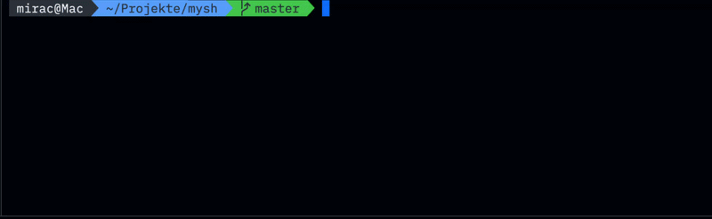

# mysh
> Eine Unix-Shell in C++ — gebaut um zu verstehen, was wirklich passiert wenn man Enter drückt.



---

## Features

### Prompt
- **Powerline-Style** — zeigt Verzeichnis, Git Branch, Git Status (`✓`/`✗`) und Uhrzeit
- **Vollständig konfigurierbar** — alle Farben über `~/.myshrc` anpassbar
- **Startup Animation** — Logo beim Start (instant, typewriter oder fade-in)

### Befehle
- **Farbiges `ls`** — Dateien nach Typ eingefärbt (C++, JS/TS, HTML, CSS, JSON, Java, Python, ...)
- **`echo`** — mit Variablen-Support (`$HOME`, `$PATH`, ...)
- **`export`** — Umgebungsvariablen setzen
- **`alias`** — Abkürzungen definieren, werden in `~/.myshrc` gespeichert
- **`history`** — alle Befehle der Session anzeigen
- **`config`** — öffnet `~/.myshrc` direkt in nvim
- **`sf [filter]`** — Datei fuzzy suchen und in `$EDITOR` öffnen
- **`sd [filter]`** — Ordner fuzzy suchen und direkt navigieren

### Shell-Funktionen
- Pipes `|`, Sequenz `;`, bedingte Ausführung `&&` / `||`
- I/O Umleitung `>`, `>>`, `<`
- Tilde-Expansion, Command History, Tab Autocomplete
- Quoted Arguments, Ctrl+C

---

## Performance

Startup-Zeit, gemessen mit [hyperfine](https://github.com/sharkdp/hyperfine)
auf Arch Linux (x86_64), 2000+ Läufe pro Shell:

| Shell | Startup |
|:---|---:|
| dash | 0.53 ms |
| bash | 0.85 ms |
| zsh | 0.92 ms |
| **mysh** | **1.5 ms** |

Mit aktivem Git-Prompt innerhalb eines Repositories liegt mysh bei 4.0 ms.
Die Differenz ist der `git status`-Subprozess für die Clean/Dirty-Anzeige —
gemessen mit `strace -c` entfielen darauf rund zwei Drittel der gesamten
Syscall-Zeit. Ausserhalb eines interaktiven Terminals wird das
Prompt-Rendering deshalb komplett übersprungen.

Zur Einordnung: bash und zsh lesen bei nicht-interaktivem stdin ihre
rc-Dateien nicht ein und zeigen in diesem Vergleich keinen Git-Status.

Reproduzieren:

```bash
echo exit > exit.txt
hyperfine -N --warmup 20 --input exit.txt ./shell /bin/dash /bin/bash /bin/zsh
```

Das `-N` ist wichtig — ohne wird jeder Lauf durch `/bin/sh` gestartet und
man misst überwiegend dessen Overhead.

### Speicher

Geprüft mit Valgrind (Memcheck) über einen Durchlauf mit Pipes,
Redirections, Aliases und fehlschlagenden Kommandos:

```
ERROR SUMMARY: 0 errors from 0 contexts
definitely lost: 0 bytes in 0 blocks
indirectly lost: 0 bytes in 0 blocks
  possibly lost: 0 bytes in 0 blocks
```

Die verbleibenden "still reachable"-Blöcke stammen aus readline, das seine
internen Puffer beim Beenden nicht freigibt.

```bash
valgrind --leak-check=full --track-origins=yes ./shell < cmds.txt
```

---

## Voraussetzungen

- C++17 oder neuer
- readline ≥ 8.0
- make
- fzf (für `sf` und `sd`)

---

## Installation

**Arch Linux**
```bash
sudo pacman -S readline fzf
git clone https://github.com/Mirac61/mysh
cd mysh && make && ./shell
```

**Linux (Debian/Ubuntu)**
```bash
sudo apt install libreadline-dev fzf
git clone https://github.com/Mirac61/mysh
cd mysh && make && ./shell
```

**macOS**
```bash
brew install readline fzf
git clone https://github.com/Mirac61/mysh
cd mysh && make && ./shell
```

---

## Konfiguration

```bash
cp examples/example.myshrc ~/.myshrc
```

<details>
<summary>Alle Optionen</summary>
<br>

| Option | Werte | Beschreibung |
|--------|-------|--------------|
| `prompt_folder` | 0–255 | Farbe des Ordnernamens |
| `prompt_time` | 0–255 | Farbe der Uhrzeit |
| `prompt_git_clean` | 0–255 | Farbe bei sauberem Repo |
| `prompt_git_dirty` | 0–255 | Farbe bei uncommitted Änderungen |
| `startup` | 0–3 | 0 = kein Logo, 1 = sofort, 2 = typewriter, 3 = fade-in |
| `alias` | `name="befehl"` | Eigene Shortcuts |

Alle 256 Farben anzeigen:
```bash
for i in {0..255}; do echo -e "\033[48;5;${i}m $i \033[0m"; done
```
</details>

---

## Tests

```bash
./test.sh
```

---

<details>
<summary>Benutzung</summary>
<br>

```bash
# Navigation
cd ~/Projekte
ls -la

# Fuzzy Search
sf main       # Datei suchen → in $EDITOR öffnen
sd Proj       # Ordner suchen → direkt navigieren

# Pipes und Umleitung
ls | grep .cpp
ls > output.txt

# Bedingte Ausführung
make && ./shell
cd /nicht/vorhanden || echo "Verzeichnis nicht gefunden"

# Aliases und Variablen
alias ll="ls -la"
export NAME=Mirac
echo $NAME
```
</details>

---

<details>
<summary>Projektstruktur</summary>
<br>

```
mysh/
├── include/
│   └── shell.hpp       # Deklarationen, Farb- und Konstanten-Definitionen
├── src/
│   ├── main.cpp        # Hauptschleife, Prompt-Aufbau
│   ├── builtins.cpp    # Built-in Befehle (cd, export, alias, sf, sd, ...)
│   ├── parse.cpp       # Input-Parsing, Pipes, Redirect, Quote-Handling
│   ├── execute.cpp     # Prozessausführung, Pipes, I/O Umleitung
│   ├── process.cpp     # Job-Verwaltung, Hintergrundprozesse
│   ├── config.cpp      # ~/.myshrc laden und speichern
│   ├── git.cpp         # Git-Erkennung für Prompt
│   ├── ls.cpp          # eigenes ls mit Dateityp-Färbung
│   └── startup.cpp     # Startup-Animation
├── tests/
│   └── shell_tests.cpp
├── examples/
│   └── example.myshrc  # Beispiel-Konfiguration
├── benchmark-results/
└── Makefile
```
</details>

---

<details>
<summary>Warum?</summary>
<br>
Die meisten Tutorials erklären die Theorie. Ich wollte eine Shell bauen und dabei wirklich verstehen, was zwischen Enter-drücken und Output-sehen passiert — <code>fork()</code>, <code>execvp()</code>, <code>dup2()</code>, <code>pipe()</code>, alles davon.
</details>

## Startup Animationen
Die Animationen wurden mit Unterstützung von Claude (Anthropic) entwickelt.
